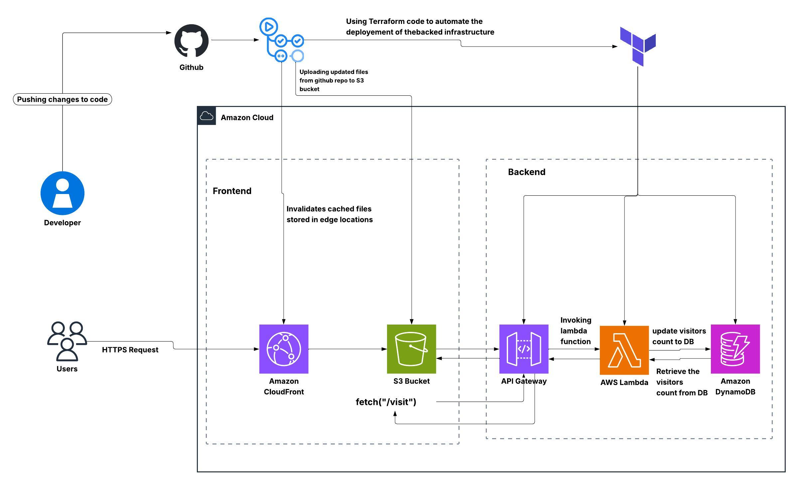

# Cloud Resume Challenge – AWS Serverless Implementation


---

## Overview

This repository contains a production-grade implementation of the Cloud Resume Challenge built entirely on AWS.  
The solution demonstrates enterprise-ready cloud engineering practices such as serverless backend design, Infrastructure as Code, and automated CI/CD pipelines.

---

## Architecture

<p align="center">
  
</p>


---

## System Flow

1. Code is pushed to the `main` branch in GitHub.  
2. GitHub Actions triggers the CI/CD workflow.  
3. Frontend assets are uploaded to the S3 bucket.  
4. CloudFront cache is invalidated.  
5. Users access the resume through a CloudFront HTTPS URL.  
6. Browser requests the `/visit` API endpoint.  
7. API Gateway invokes the Lambda function.  
8. Lambda updates and retrieves the visitor count in DynamoDB.  
9. The count is returned and rendered dynamically.

---

## Technology Stack

| Layer | Services |
|------|----------|
| Frontend | Amazon S3, CloudFront |
| Backend | API Gateway, AWS Lambda |
| Database | DynamoDB |
| IaC | Terraform |
| CI/CD | GitHub Actions |
| Security | IAM, CloudFront OAC |

---

## Repository Structure

```

./
├── backend/ # AWS Lambda visitor counter code
├── dist/ # Vite production build output
├── public/ # Static assets and architecture diagram
├── src/ # React / Vite frontend source
├── terraform/ # Infrastructure as Code (Terraform)
└── .github/ # GitHub Actions CI/CD workflowss

````

---

## CI/CD Pipeline

The deployment workflow automatically runs on every push to the `main` branch and:

- Syncs frontend files to S3  
- Invalidates CloudFront cache  
- Publishes the updated resume globally

---

## Deployment

```bash
terraform init
terraform apply
````
## 👩‍💻 Author

[](https://www.linkedin.com/in/harini-muruganantham)
[](https://github.com/HariniMuruganantham)
[](https://substack.com/@harinimuruganantham)

**Harini Muruganantham**  
DevOps Engineer | AWS | 


```
```
