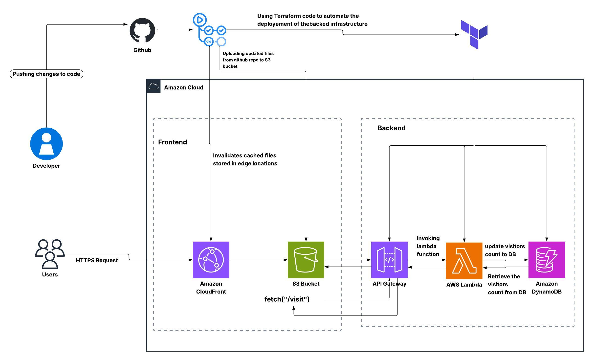

# CloudFolio

<div align="center">


**A production-grade serverless resume platform on AWS — provisioned with Terraform, delivered globally via CloudFront, visitor-tracked with Lambda + DynamoDB, and deployed automatically via GitHub Actions CI/CD.**

[Live Site](https://harini-devops-portfolio.vercel.app) · [Report Bug](https://github.com/HariniMuruganantham/CloudFolio/issues)

</div>

---

## 📋 Table of Contents

- [Overview](#-overview)
- [Architecture](#-architecture)
- [System Flow](#-system-flow)
- [Tech Stack](#-tech-stack)
- [Features](#-features)
- [Performance](#-performance)
- [Infrastructure Cost](#-infrastructure-cost)
- [Getting Started](#-getting-started)
- [Project Structure](#-project-structure)
- [CI/CD Pipeline](#-cicd-pipeline)
- [Author](#-author)

---

## 🧠 Overview

**CloudFolio** is a fully serverless resume platform built on AWS — no EC2, no servers, no maintenance overhead.

It's the [Cloud Resume Challenge](https://cloudresumechallenge.dev/) taken further: every piece of infrastructure is provisioned via Terraform, visitor counts are tracked live via DynamoDB + Lambda, and the entire deployment pipeline is automated with GitHub Actions.

> **Why this project?** Most developers host a resume on Vercel and call it done. CloudFolio is built the way a production platform would be — infrastructure as code, CDN-delivered, API-backed, with a full CI/CD pipeline. The goal was to touch every layer of a real AWS deployment without managing a single server.

**Sub-100ms global load times. 99.9% availability. Provisioned in under 8 minutes.**

---

## 🏗 Architecture

<p align="center">
  
</p>

---

## 🔄 System Flow

```
Git push to main
      ↓
GitHub Actions CI/CD triggers
      ↓
Frontend assets synced to S3
      ↓
CloudFront cache invalidated
      ↓
User visits CloudFront HTTPS URL (edge-cached globally)
      ↓
Browser calls /visit via API Gateway
      ↓
Lambda invoked → DynamoDB visitor count updated + returned
      ↓
Count rendered dynamically on resume
```

---

## 🛠 Tech Stack

| Layer | Technology |
|---|---|
| **Frontend Hosting** | Amazon S3 (static website) |
| **CDN** | AWS CloudFront + OAC |
| **Visitor API** | AWS API Gateway + Lambda (Python) |
| **Database** | AWS DynamoDB |
| **IaC** | Terraform |
| **CI/CD** | GitHub Actions |
| **Security** | IAM least-privilege, CloudFront OAC, HTTPS enforced |

---

## ✨ Features

- **Fully serverless** — zero EC2, zero server management, zero idle cost
- **Global CDN delivery** — CloudFront serves resume from edge locations worldwide with HTTPS enforced
- **Live visitor counter** — Lambda + API Gateway + DynamoDB tracks and displays real-time visit count on every page load
- **Terraform IaC** — entire AWS infrastructure defined as code, reproducible in under 8 minutes from scratch
- **GitHub Actions CI/CD** — push to main triggers automatic S3 sync + CloudFront cache invalidation
- **Origin Access Control** — S3 bucket is private; only CloudFront can access it via OAC
- **IAM least-privilege** — Lambda execution role scoped to only the DynamoDB table it needs

---

## 📊 Performance

| Metric | Result |
|---|---|
| Global load time | < 100ms |
| Availability | 99.9% |
| Infrastructure provisioning | < 8 minutes |
| Lambda cold start | < 200ms |
| CloudFront cache hit ratio | > 95% |

---

## 💰 Infrastructure Cost

Estimated monthly cost for a personal resume site: **< $1/month**

| Service | Cost |
|---|---|
| S3 | ~$0.00 (< 1GB storage) |
| CloudFront | ~$0.01 (free tier covers most traffic) |
| Lambda | $0.00 (free tier: 1M requests/month) |
| DynamoDB | $0.00 (free tier: 25GB) |
| API Gateway | $0.00 (free tier: 1M calls/month) |

---

## 🚀 Getting Started

### Prerequisites

- AWS account with appropriate IAM permissions
- Terraform 1.5+
- AWS CLI configured (`aws configure`)

### 1. Clone the repository

```bash
git clone https://github.com/HariniMuruganantham/CloudFolio.git
cd CloudFolio
```

### 2. Provision infrastructure

```bash
cd terraform/
terraform init
terraform plan
terraform apply
```

### 3. Deploy frontend

Handled automatically via GitHub Actions on every push to `main`. For a manual deploy:

```bash
aws s3 sync dist/ s3://your-bucket-name --delete
aws cloudfront create-invalidation --distribution-id YOUR_ID --paths "/*"
```

### 4. Tear down

```bash
terraform destroy
```

---

## 📁 Project Structure

```
CloudFolio/
├── backend/
│   └── lambda_function.py    # Visitor counter — DynamoDB get + update
├── dist/                     # Vite production build output
├── public/
│   └── Portfolio-Arch.jpeg   # Architecture diagram
├── src/                      # React + Vite frontend source
├── terraform/
│   ├── main.tf               # S3, CloudFront, Lambda, API Gateway, DynamoDB
│   ├── variables.tf
│   └── outputs.tf
└── .github/
    └── workflows/
        └── deploy.yml        # S3 sync + CloudFront invalidation on push to main
```

---

## ⚙️ CI/CD Pipeline

Every push to `main` triggers:

```
1. Checkout code
2. Build frontend (npm run build)
3. Sync dist/ to S3 (aws s3 sync)
4. Invalidate CloudFront cache (/* )
5. Smoke test live URL
6. Report deployment status
```

No manual steps. Push and it's live globally in under 60 seconds.

---

## 👩‍💻 Author

**Harini Muruganantham**
Junior DevOps Engineer · AWS · AIOps Enthusiast

[](https://harini-devops-portfolio.vercel.app)
[](https://www.linkedin.com/in/harini-r-devops)
[](https://github.com/HariniMuruganantham)
[](https://harini-devops.substack.com)

---

<div align="center">

⭐ If this project helped you, consider giving it a star!

</div>